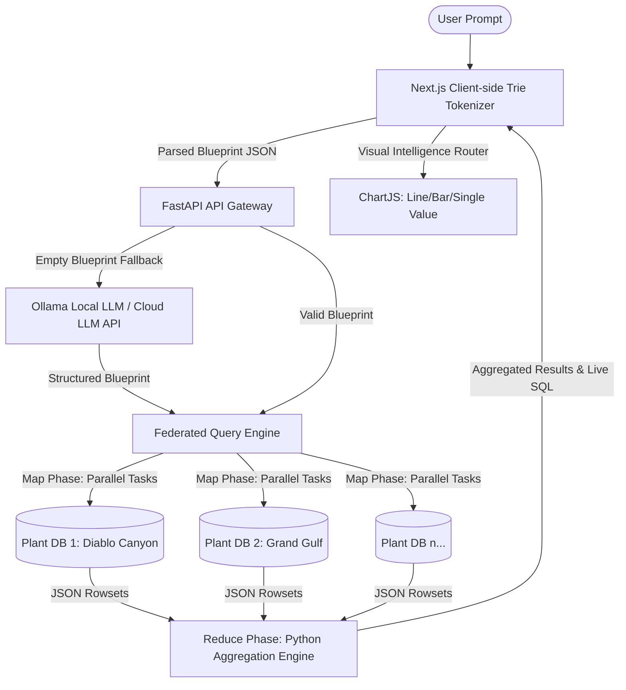

# Alphabot Enterprise v2.0 - Technical Handover & Integration Guide

This document outlines the architecture, technology stack, library dependencies, query processing pipelines, and production integration strategies required by a senior developer to integrate the sandbox prototype into the core Alphabot system.

---

## 1. Architectural Blueprint
Alphabot v2.0 implements a **Federated Map-Reduce Query Engine** to query and aggregate metrics from multiple decentralized physical plant databases in parallel.



---

## 2. Tech Stack & Dependencies

### Backend Services
* **Runtime**: `Python 3.13+` (Running with strict asyncio event loops).
* **Framework**: `FastAPI` (High-performance ASGI API gateway).
* **ASGI Server**: `Uvicorn` (Production-grade ASGI web server).
* **HTTP Client**: `httpx` (Asynchronous HTTP requests for AI fallbacks).
* **Data Validation**: `Pydantic v2` (Forces contract compliance on incoming payloads).
* **Database Connectors**:
  * *Sandbox*: Native `sqlite3` (using `asyncio.get_event_loop().run_in_executor`).
  * *Production*: Senior developers should swap this for asynchronous database drivers (e.g., `asyncpg` for PostgreSQL, `aiomysql` for MySQL).
* **Testing Framework**: `pytest` and `pytest-asyncio` (Fully mocks isolated database operations for fast CI/CD execution).

### Frontend Dashboard Client
* **Framework**: `Next.js 14` (App Router structure).
* **State & Styling**: `React 18` + `@raydenui/ui` (Design system components).
* **Visualization Engine**: `Chart.js` & `react-chartjs-2` (Handles time-series, categories, and single-value visual components).
* **Token Matching Engine**: Client-side **Prefix Trie** compiled on page load for zero-latency token classification.

---

## 3. Core Database Schemas
Each database represents an isolated node (plant/business unit). Each node contains a metrics table (e.g., `metrics_grand_gulf`) conforming to this structured schema:

| Column Name | Type | Key | Description |
| :--- | :--- | :--- | :--- |
| `id` | `INTEGER` | `PRIMARY KEY` | Unique transaction ID |
| `record_date` | `TIMESTAMP` | `INDEXED` | ISO-8601 Timestamp of data point |
| `department` | `VARCHAR(50)`| `INDEXED` | Business division (e.g., `sales`, `digital`) |
| `region` | `VARCHAR(50)`| `INDEXED` | Geographic territory (e.g., `south`, `north`) |
| `revenue` | `NUMERIC` | - | Earnings in USD |
| `profit` | `NUMERIC` | - | Net earnings in USD |
| `expenses` | `NUMERIC` | - | Total expenditures in USD |
| `headcount` | `INTEGER` | - | Total employees at timestamp |
| `salary` | `NUMERIC` | - | Monthly salary expenditure in USD |
| `tax_liability` | `NUMERIC` | - | Calculated corporate tax in USD |
| `asset_value` | `NUMERIC` | - | Estimated valuation of assets in USD |
| `operating_cost`| `NUMERIC` | - | Overhead costs in USD |
| `marketing_spend`| `NUMERIC`| - | Ad and promotional spending in USD |
| `customer_count`| `INTEGER` | - | Active consumers served at timestamp |

---

## 4. Query & Token Classification Engine

### Step 1: Client-Side Tokenization
When the user types, the UI feeds text into a **Prefix Trie** populated on page load with metadata keywords (metrics, departments, plants, regions, operations). 

```typescript
// Token types returned by client tokenizer:
export type TokenType = 'ACTION' | 'METRIC' | 'DIMENSION' | 'TEMPORAL' | 'COMPARATOR' | 'VALUE' | 'FLUFF';
```

If the client-side parser generates a fully validated blueprint, it bypasses the LLM entirely, sending the schema directly to `/api/query` (bypassing model token latency).

### Step 2: The Gateway Contract
The payload structure sent to `/api/query` is validated by Pydantic:

```python
class Blueprint(BaseModel):
    operation: str = "SUM"  # Options: SUM, AVERAGE, GRAPH, BREAKDOWN
    metrics: List[str] = []
    filters: List[Dict[str, str]] = []  # format: [{"column": "department", "value": "sales"}]
    timeframe: Optional[Dict[str, str]] = None  # format: {"type": "year", "value": "2026"}

class QueryBlueprintPayload(BaseModel):
    raw_query: str
    blueprint: Optional[Blueprint] = None
```

### Step 3: Dynamic Defaulting Engine
If the incoming blueprint is empty, it uses the Ollama system prompt to map the natural query. If `metrics` is omitted for a breakdown query with precise dimension filters (e.g., region, plant, and department):
* The engine automatically defaults to retrieving **all 10 metrics** in the schema registry.
* The query translates to a full record retrieval of that single intersection point.

---

## 5. Federated Execution Flow

1. **Introspection & Initialization**:
   On ASGI server start, the `MetadataRegistry` singleton inspects the first active database node schema using `PRAGMA table_info` to dynamically determine columns. It populates metric names and categorical options to build client-side trie matching rules.
2. **Plant-Level Routing (Map Phase)**:
   If `plant` is specified in the filters (e.g. `plant = "grand_gulf"`), the gateway routes tasks exclusively to `grand_gulf.db`. If no plant filter is defined, the engine executes queries against **all 8 nodes in parallel** using `asyncio.gather` on thread pools.
3. **Map-Reduce Python Aggregator (Reduce Phase)**:
   * **Categorical breakdown**: Aggregates records across different databases grouped by plant name.
   * **Temporal series (`GRAPH`)**: Merges database responses grouped by time buckets (`strftime('%Y-%m', record_date)`).
   * **Multi-Metric Single Point**: Aggregates a single row mapping all 10 metrics side-by-side.

---

## 6. Frontend Visual Routing
The React component `DynamicChart.tsx` determines chart types based on rowsets returned:

```typescript
// 1. Single Value Card
if (results.length === 1 && numericKeys.length === 1) {
    return <SingleValueDisplay value={results[0][numericKeys[0]]} ... />
}

// 2. Bar Chart (For Single-Record Multi-Metric Breakdowns)
if (results.length === 1 && numericKeys.length > 1) {
    return <Bar data={data} options={barOptions} /> // Displays all 10 metrics side-by-side
}

// 3. Category Bar Chart (For multiple plants/departments/regions)
if (labels.length > 1 && typeof labels[0] === 'string') {
    return <Bar data={data} options={commonOptions} />
}

// 4. Time-Series Line Chart (For temporal trends)
if (numericKeys.length > 0) {
    return <Line data={data} options={commonOptions} />
}
```

---

## 7. Production Integration Checklist for Senior Developers

1. **Replace Database Adapters**:
   * Replace the SQLite `run_query_on_single_db` wrapper with an asynchronous connection pooler utilizing `SQLAlchemy` or `Tortoise ORM` backed by PostgreSQL read-replicas.
2. **Implement API Gatekeepers**:
   * Add middleware verifying authentication tokens (e.g., standard OAuth2 bearer tokens or `X-API-KEY` checks in HTTP headers).
3. **Model Hosting**:
   * Swap out the sandbox local `Ollama` endpoint for a high-availability hosted cluster (e.g. AWS Bedrock, Google Vertex AI, or internal vLLM servers) using async API request handlers.
4. **Caching Layer**:
   * **Exact Caching**: Integrate a `Redis` caching layer key-value mapped by hashed SQL queries. Queries targeting historical dates (e.g. 2020-2025) should write/read from Redis to completely eliminate database execution load on static data.
   * **Semantic Caching (LLM Parser Optimization)**:
     * Implement a **Semantic Cache** (e.g., using `GPTCache` or custom vector similarity middleware) in front of the LLM fallback endpoint to avoid repeating expensive LLM calls for semantically similar prompts.
     * **Vector Database**: Use `Redis` (with `RediSearch` vector similarity), `ChromaDB`, or `Qdrant` to index vector embeddings of natural language queries.
     * **Embeddings Model**: Utilize local lightweight models (like `sentence-transformers/all-MiniLM-L6-v2`) or cloud endpoints (like OpenAI's `text-embedding-3-small`) to convert input streams into vector arrays.
     * **Threshold Matching**: If the cosine similarity of an incoming user query to an existing cached prompt is above `0.95`, immediately return the cached SQL blueprint/response and bypass the LLM entirely.
5. **Worker Orchestration & Connection Pooling**:
   * For database connectivity, enforce connection pooling (e.g., PgBouncer for PostgreSQL) to prevent connection starvation from multiple parallel plant queries.
   * For extremely large datasets, migrate the Python in-memory reduce aggregation to a task-queuing system (like `Celery`) or distributed compute framework (like `Apache Spark`).
